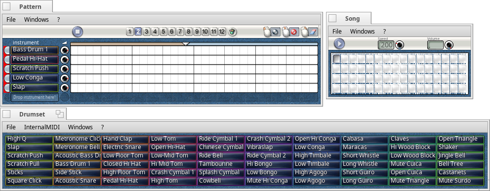

# PecoBeat

PecoBeat is a MIDI drum computer for Haiku

## Requirements

* [InternalMidi](https://github.com/HaikuArchives/InternalMIDI.git)

## License

Released under the terms of the MIT license with permission
from Werner Freytag.
